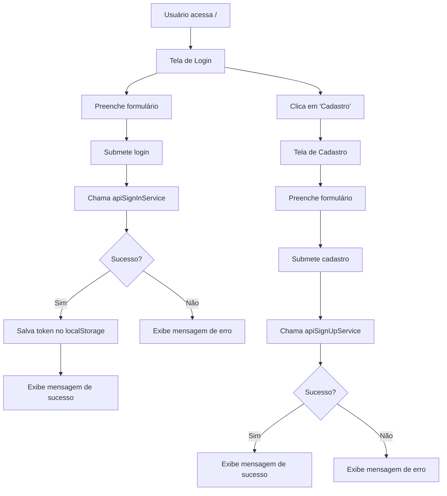

# Página de Login

Este é um front-end simples para autenticação de usuários, desenvolvido com React, TypeScript e Vite. O aplicativo permite que os usuários façam login ou se cadastrem, interagindo com uma API backend para autenticação.

## Funcionalidades

- **Tela de Login**: Permite que usuários existentes façam login com email e senha.
- **Tela de Cadastro**: Permite que novos usuários se cadastrem.
- **Integração com API**: Usa Axios para comunicar com o backend em `http://localhost:3333`.
- **Armazenamento Local**: Salva o token de autenticação no localStorage após login bem-sucedido.
- **Design Responsivo**: Usa Tailwind CSS para um layout moderno e adaptável.

## Processo de Funcionamento

O aplicativo funciona da seguinte maneira:

1. **Navegação Inicial**: Ao acessar a raiz (`/`), o usuário é direcionado para a tela de login.
2. **Login**:
   - O usuário preenche o formulário com email e senha.
   - Ao submeter, o aplicativo chama o serviço `apiSignInService`, que faz uma requisição POST para `/sign-in` no backend.
   - Se a resposta for bem-sucedida, o token é salvo no localStorage e uma mensagem de sucesso é exibida.
   - Em caso de erro, uma mensagem de falha é mostrada.
3. **Cadastro**:
   - O usuário pode navegar para `/signup` clicando no link "Cadastro".
   - Na tela de cadastro, um formulário similar permite o registro, chamando o serviço `apiSignUpService` para POST em `/sign-up`.
4. **Roteamento**: Usa React Router para gerenciar as rotas entre login e cadastro.

### Fluxo de Navegação e Autenticação



## Tecnologias Utilizadas

- **React**: Biblioteca para construção da interface.
- **TypeScript**: Para tipagem estática.
- **Vite**: Ferramenta de build e dev server.
- **Tailwind CSS**: Framework CSS para estilização.
- **Axios**: Cliente HTTP para requisições à API.
- **React Router DOM**: Para roteamento de páginas.

## Como Rodar o Serviço

### Pré-requisitos

- Node.js (versão 16 ou superior)
- npm ou yarn

### Passos para Execução

1. **Clone ou baixe o repositório** (se aplicável) e navegue até a pasta do projeto:

   ```
   cd /caminho/para/login-page
   ```

2. **Instale as dependências**:

   ```
   npm install
   ```

3. **Inicie o servidor de desenvolvimento**:

   ```
   npm run dev
   ```

4. **Acesse o aplicativo**:
   - Abra o navegador e vá para `http://localhost:5173` (porta padrão do Vite).

### Scripts Disponíveis

- `npm run dev`: Inicia o servidor de desenvolvimento.
- `npm run build`: Compila o projeto para produção.
- `npm run lint`: Executa o linter para verificar o código.
- `npm run preview`: Visualiza a build de produção localmente.

### Notas

- Certifique-se de que o backend esteja rodando em `http://localhost:3333` para que as funcionalidades de login e cadastro funcionem corretamente.
- O aplicativo usa variáveis CSS customizadas para cores, definidas no Tailwind.
